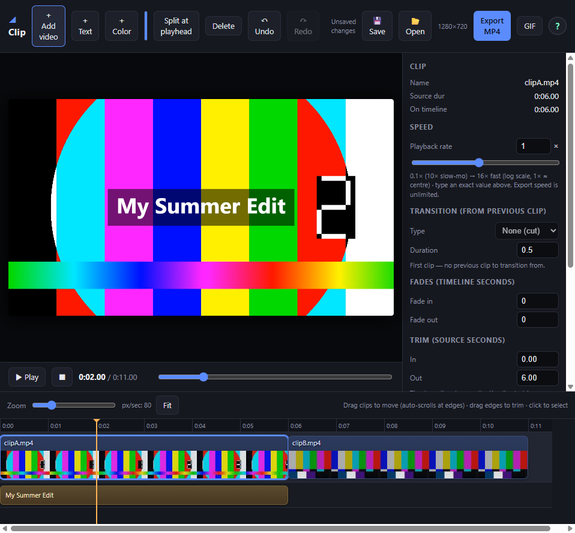

# ◢ Clip — a browser video editor in a single HTML file

**Clip** is a complete video editor that runs entirely in your browser. No install, no
account, no server, no upload. Your footage never leaves your machine — it's one
self‑contained `index.html` with **zero build step and zero dependencies**.



## Highlights

- **Multi‑clip timeline** — drag to reorder, drag edges to trim, zoom in/out, "Fit" to frame the whole edit. Thumbnails on every clip.
- **Cuts & splits** — split at the playhead (`S`), delete, or use the Cut tool to slice exactly where you click.
- **Transitions** — crossfade (dissolve) and dip‑to‑black between clips, with adjustable duration.
- **Fades** — per‑clip fade in / out from black.
- **Ken Burns zoom & pan** — animate scale and position with keyframes; markers are draggable along the timeline *and across clip boundaries*.
- **Speed** — 0.1× to 16× on a log slider (slow‑mo lengthens the clip); type an exact rate for anything in between.
- **Text & titles** — styled overlays (font, size, color, alignment, bold, backdrop box) with their own timeline track; drag to position right on the preview. Titles can run past the last clip for title‑on‑black cards.
- **Color cards** — solid‑color clips for intros/outros that take transitions and text like any clip.
- **Export** — frame‑accurate **H.264 MP4** (+ AAC audio) via the WebCodecs API, an animated **GIF** export, and a **WebM** fallback for older browsers.
- **Save / autosave** — projects (video bytes and all) live in your browser's IndexedDB; edits autosave and restore on next launch.
- **Built‑in help** — click the **?** in the toolbar for a full in‑app guide.

## Run it

It's just one file. Either:

- **Open `index.html` directly** in a modern browser (double‑click it), **or**
- Serve it over `http://localhost` for the smoothest experience:

  ```bash
  # any static server works — for example:
  python -m http.server 8000
  # then open http://localhost:8000/index.html
  ```

Then click **＋ Add video** (or drag video files onto the window) and start editing.

## Keyboard shortcuts

| Action | Key |
| --- | --- |
| Play / pause | `Space` |
| Split at playhead | `S` |
| Delete selected | `Del` |
| Step 1 frame | `←` / `→` |
| Step 1 second | `Shift` + `←` / `→` |
| Jump to start / end | `Home` / `End` |
| Undo / redo | `Ctrl`/`⌘` `+Z` / `+Shift+Z` |
| Save project | `Ctrl`/`⌘` `+S` |

## How it works

- **Preview** runs on a master clock driving native `<video>` playback for smooth, in‑sync audio.
- **Compositing** (transitions, keyframe zoom/pan, fades, text) is unified so the preview matches the export frame‑for‑frame.
- **Export** is deterministic: it seeks one frame at a time and encodes with the browser's `VideoEncoder` — it is *not* a screen recording, so the result is exact regardless of playback speed.
- Only the export muxers ([`mp4-muxer`](https://github.com/Vanilagy/mp4-muxer) and [`gifenc`](https://github.com/mattdesl/gifenc)) load from a CDN, and only at the moment you export. Everything else is offline.

## Browser support

MP4 export needs the **WebCodecs API** (Chrome / Edge, recent Safari). Where it's
unavailable, Clip automatically falls back to **WebM** via `MediaRecorder`. GIF export
works wherever ES modules and `<canvas>` do.

> **Note:** saved projects live in this browser on this machine. Clearing site data
> wipes them, so keep your source files.

## License

[MIT](LICENSE) — free to use, modify, and share.
